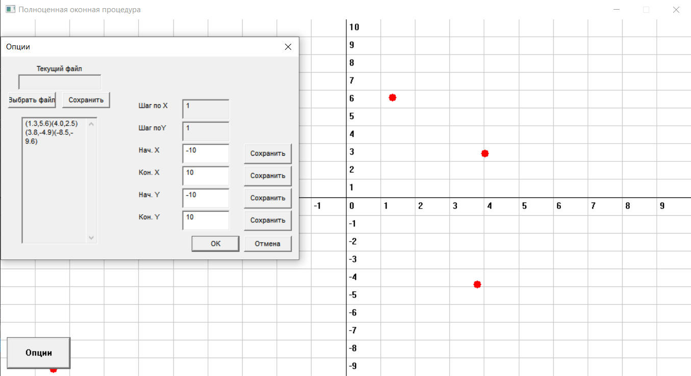

# Win32API-PointsOnThePlane

Функционал данного приложения состоит из нескольких частей:
- Добавление точек на координатную плоскость;
- Изменение масштабов горизонтальной и вертикальной осей;
- Сохранение точек в бинарный файл;
- Считывание точек из бинарного файла и их отображение на плоскости;

## Особенности 

Инициализация параметров главного окна приложения приложения происходит в функции:

    int WINAPI WinMain(HINSTANCE hInst,
                       HINSTANCE hPrevInstance,
                       LPSTR lpCmdLine,
                       int nCmdShow) { ... }  
                       
Внутри этой функции также описывается структура для записи данных в файл:

    ZeroMemory(&ofn, sizeof(ofn));
    ofn.lStructSize = sizeof(ofn);
    ofn.hwndOwner = hMainWnd;
    ofn.lpstrFile = FileName;
    ofn.nMaxFile = sizeof(FileName);
    ofn.lpstrFilter = L"All\0*.*\0Text\0*.TXT\0";
    ofn.nFilterIndex = 1;
    ofn.lpstrFileTitle = NULL;
    ofn.nMaxFileTitle = 0;
    ofn.lpstrInitialDir = NULL;
    ofn.Flags = OFN_PATHMUSTEXIST | OFN_FILEMUSTEXIST;
    
За обработку событий в основном окне приложения отвечает функция обратного вызова 

    LRESULT CALLBACK WndProc(HWND hWindow, UINT uMessage, WPARAM wParam, LPARAM lParam) { ... }
    
В ней же, при нажатии на кнопку "Опции", происходит создание *модального диалогового окна*

    switch (uMessage) {
		case WM_CREATE:
			hInst = ((LPCREATESTRUCT)lParam)->hInstance;
		
			hButton = CreateWindow(L"button", L"Îïöèè", WS_CHILD | WS_VISIBLE | WS_BORDER,
				10, 500, 100, 50, hWindow, (HMENU) IDB_BUTTONOPTIONS, hInst, NULL);
			ShowWindow(hButton, SW_SHOWNORMAL);

			break;
    ...
    }
    
В созданном модальном окне, за обработку событий отвечает его собственная функция обратного вызова

    BOOL CALLBACK ModalDialogOptionsProc(HWND hWindowDlg, UINT uMessage, WPARAM wParam, LPARAM lParam) { ... }
    
## График и точки

Класс [Graphic](https://github.com/fedyarov/Win32API-PointsOnThePlane/blob/master/Graphic.h "Graphic.h") содержит два вектора с координатами X и Y отмеченных точек, 
информацию о масштабе, а также предоставляет основной интерфейс для работы с приложением.
